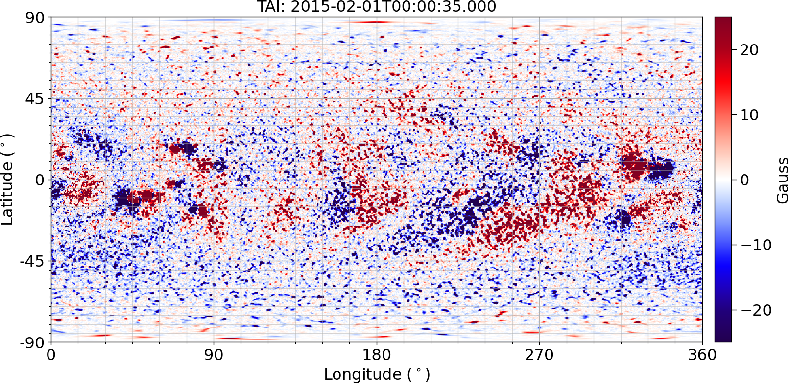

# OFTSWA Run Example
  
Since running MagMAP and ConFlow takes considerable time, 
we have provided a pre-computed run of OFTSWA that ran a month/CR of  
ConFlow and MagMAP.  This run data can be used to launch OFTSWA  
to run HipFT using the data.  We have provided a YAML input  
file for OFTSWA for the run. 

The YAML file and run data are available in a zenodo package.

### Install OFT  

To run the example, first make sure OFT is properly installed as described in the [installation instructions]<install.md>.  

### Make a Main Run Directory  
```
cd <PATH-TO-OFT-INSTALLATION>
mkdir oft/runs
cd oft/runs
```

### Download the example run data from zenodo  
Download the contents of the zenodo example package:  
<https://zenodo.org/records/14799033>  
and untar it into the run folder:
```
tar -xf oftswa_example_run1_conflow_magmap.tar <PATH-TO-OFT-INSTALLATION>/oft/runs/
```

### Source the OFT startup script with the command  
```
. <PATH-TO-OFT-INSTALLATION>/oft/code/load_oft_env.sh
```

### Run OFTSWA with the YAML input file included in the Zenodo package   
```
oftswa.py oftswa_example_run2_hipft.yaml -o <PATH-TO-OFT-INSTALLATION>/oft/runs
```

After the HipFT run is complete, the maps will be processed and all post processing will be produced.  The last frame is shown here:

 


